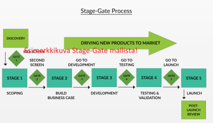
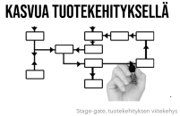

# Stage-Gate tuotekehityksen viitekehys 

Tämä README.md (ja repositorio) on tehty GitHubin testausta varten ja tällä on tarkoitus herättää ajatuksia siitä mitä GitHubissa julkaistava materiaali tulisi sisältää. Korjausehdotuksia ja kehitysajatuksia toivotaan ja niitä voi laittaa esimerkisi sähköpostilla osoitteeseen martti.hamalainen@seamk.fi.


# Julkaisun historiatiedot
Merkittävät muutokset julkaisuun.
|Pvm|Nimi|Tehty muutos|
|---|---|---|
|18.1.2023|Martti Hämäläinen|Lisätty matemaattisten kaavojen esittäminen|
|19.1.2023|Martti Hämäläinen|Lisätty kaavioiden esittäminen|

# Sisällysluettelo
Voit tehdä sisällysluettelon `Ctrl` + `Shift` + `P` -näppäimillä.

# Teknologiapilotti

Linkki pilotin julkaisuun, jos sellainen löytyy.
<!-- Tähän joku hyvä esimerkki, jos löytyy ... -->


# Hanketiedot
Alla esimerkki hanketietojen esittämisestä.

Stage-Gate esimerkkisivusto on julkaistu Kasvua tuotekehityksellä Etelä-Pohjanmaan valmistavan teollisuuden pk-yrityksissä -hankkeessa.

- Hankkeen nimi: Kasvua tuotekehityksellä Etelä-Pohjanmaan valmistavan teollisuuden pk-yrityksissä
- Hankkeen rahoittaja: Euroopan Sosiaalirahasto ESR
- Kehityshankkeen aikataulu: 1.3.2020 – 30.06.2023

Lisätietoa hankkeesta:
[Kasvua tuotekehityksellä Etelä-Pohjanmaan valmistavan teollisuuden pk-yrityksissä -hankkeen nettisivut](https://projektit.seamk.fi/alykkaat-teknologiat/kasvua-tuotekehityksella-valmistavan-teollisuuden-pk-yrityksissa/)


# Kuvaus

## Stage-Gate tuotekehityksen viitekehys
Esimerkkikuva:



Stage-Gate on uustuotekehityksessä yleisesti käytetty viitekehys, joka jakaa tuotekehitysprosessin vaiheisiin ja portteihin. Porttien tehtävä on varmistaa, että määritellyt tehtävät ovat edellisen vaiheen aikana tehty. Tämän lisäksi portit toimivat myös välietappeina, joissa arvioidaan onko projektia syytä jatkaa eteenpäin. 

## Stage-Gate viitekehyksen kuvaus

|Nimi|Linkki|
|---|---|
| Stage-gate tuotekehityksen viitekehys | [Stage-Gate-viitekehys pdf-muodossa.](content/stage-gate-tuotekehityksen-viitekehys.pdf)  |
| Stage-gate tuotekehityksen viitekehys -Youtube-video |[](http://www.youtube.com/watch?v=UrYm6cSArHI)|

Ohessa linkki yhteistyörobotiikan koneturvallisuusnäkökulmiin, joita VTT on tutkielmassaan esittänyt
[Ohessa linkki](/content/VTT_Sgn_CobotSafety2022.pdf)

## Matemaattisten kaavojen esittäminen
Matemaattiset kaavat voidaan esittää $ ja $$-merkeillä erotellulla LaTeX-syntaksilla, esimerkiksi alla olevalla tavalla.

**Poisson-jakauma** voidaan kirjoittaa "$$f(x) = \frac{ \mu^x}{x!}e^{-\mu} ,(x = 0, 1, ...)$$", mikä näyttää seuraavalta:
$$f(x) = \frac{ \mu^x}{x!}e^{-\mu} ,(x = 0, 1, ...)$$  

## Kaavioiden esittäminen
Kaavioita voi kirjoittaa suoraan Markdown-dokumenttiin Mermaid-skriptikielellä.
[Esimerkkejä kaavioista](content/kaavio-esimerkkeja.md)


# Tavoitteet (esim. hankejulkaisussa)
Kuvaus tavoitteesta, jos julkaisussa on tarvetta määrittää tavoite.
<!-- Tähän esimerkki hankkeen tavoitteista -->


# Toimenpiteet (esim. hankejulkaisussa)
Julkaisun tavoitteeseen liittyvät toimenpiteet.
<!-- Tähän esimerkki toimenpiteistä-->


# Asennus (esim. koodin julkaisussa)
Käytä asennusohjeessa koodinupotuslaatikkoa selventämään komentoriville kirjoitettavia komentoja. Alla esimerkki koodia sisältävän tekstin kirjoittamisesta.


```bash
npx create-react-app my-app
```

Koodin julkaisussa kirjoita ohjelmointikielen nimi (esim. ```python), jolloin saat värit selventämään koodia.

- Funktio `add` ottaa parametrit `a` ja `b` ja palauttaa niiden summan.
  
```python
def add(a, b):
    # This function returns the sum of given numbers
    return a + b
```

# Vaatimukset (esim. koodin julkaisussa)
Tähän edellytykset mitä tarvitaan, jotta ohjelma toimii.
<!-- Tähän esimerkki vaatimuksista, esim. laitevaatimukset-->


# Käyttö/käynnistys (esim. koodin julkaisussa)
Tähän kuinka ohjelmaa käytetään/käynnistetään. Esimerkiksi alla olevalla tavalla.

Käynnistä ohjelma project-kansiossa
```bash
npm start  
```
ja avaa selaimessa
```
http://localhost:3000
```

Huom! Koodiesimerkit React-tutorialista. [Tutorial: Intro to React](https://reactjs.org/tutorial/tutorial.html)


# Tulokset (esim. hankejulkaisussa)
Alla esimerkki hankkeen tuloksien kirjoittamisesta.

Hankkeen tuloksena syntyy:
- Alueen valmistavan teollisuuden pk-yrityksen henkilöstölle soveltuva tuotekehityksen malli
- Jatkuvan oppimisen alusta oppimateriaaleineen
- Tapauskuvauksia alueen valmistavan teollisuuden pk-yrityksistä
- Koko ekosysteemin uusi tapa toimia ja jakaa osaamistaan


# Lisenssi
Dokumentit lisensoitu:
[](https://creativecommons.org/licenses/by/4.0/)


# Tekijät
- Martti Hämäläinen
- Juho Pirttilahti


